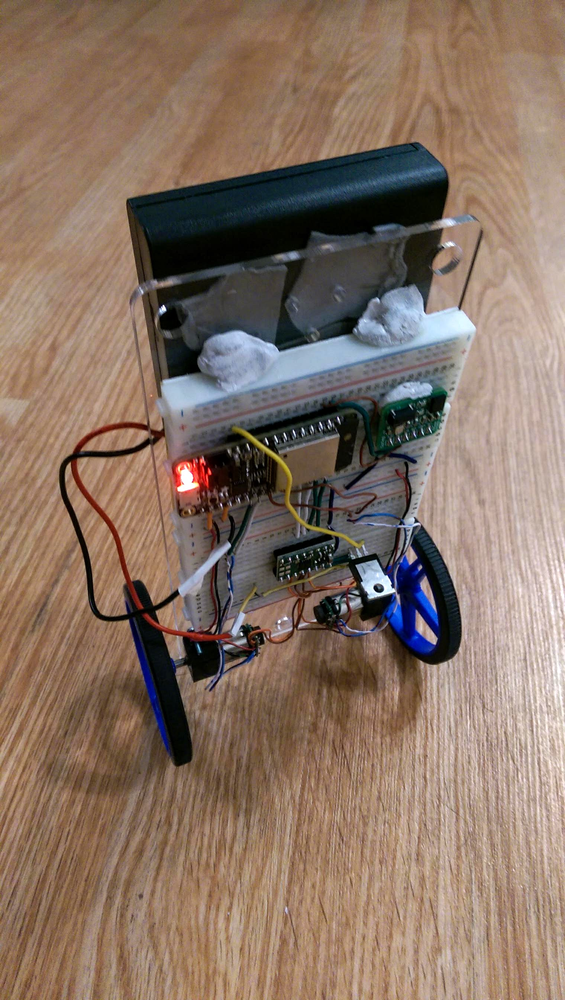

# ESP32 Micropython Balancing Robot

Code for an ESP32 Micropython balancing robot. Battery needs to be mounted higher for it to function though.

You will need to provide your own drv8833.py, encoder.py, and motor.py. Adjust the pin mapping to your motors at the top of main.py.

Hardware:
 - ESP32
 - BNO055 IMU
 - DRV8833 motor driver
 - Pololu 75:1 motors

Running the BNO055's I2C clock at under 15kHz works relatively reliably.

BNO055 driver originally from: https://bitbucket.org/thesheep/micropython-bno055

### BNO055
For just using the BNO055, download bno055.py and functools.py.